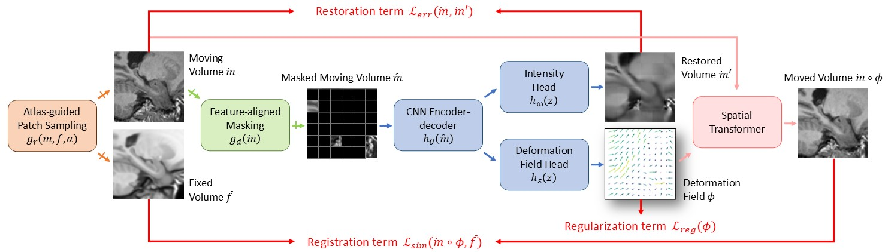

# MDM

By Junyan Lyu, Perry F. Bartlett, Fatima A. Nasrallah, Xiaoying Tang.

This repository contains an official implementation of MDM for the TMI paper ["Masked Deformation Modeling for Volumetric Brain MRI Self-supervised Pre-training"]().



## Quick start

### Environment

This code is developed using on Python 3.9.13 and **Pytorch 2.0.1** on CentOS 7 with NVIDIA GPUs. Training and testing are performed using 4 NVIDIA Tesla A100 or RTX A6000 GPU with CUDA 11.8. Other platforms or GPUs are not fully tested.

### Install

```shell
conda create -n mdm python=3.9.13
conda activate mdm
pip install torch==2.0.1 torchvision==0.15.2 torchaudio==2.0.2 --index-url https://download.pytorch.org/whl/cu118
pip install -r requirements.txt
```

### Data

1. Select and download the isotropic (spacing < 1.1mm) T1-weighted brain MRIs from [ADNI](adni.loni.usc.edu).
2. Perform skull-stripping and affine transformation to MNI152 for all the MRIs using [ANTs](https://github.com/ANTsX/ANTs).
3. Create a file list for preprocessed MRI paths using 

```shell
cd MDM
ls path/to/mri/*.gz > datasets/adni_mni152_affine_clean.txt
```

### Pre-training

Modify ```--data_path``` and ```--atlas_path``` into your actual paths

```shell
bash scripts/pretrain.sh mdm_run1
```

## Citation
If you find this repository useful, please consider citing TMI paper:

```
@ARTICLE{lyu2024mdm,
  author={Lyu, Junyan and Bartlett, Perry F. and Nasrallah, Fatima A. and Tang, Xiaoying},
  journal={IEEE Transactions on Medical Imaging}, 
  title={Masked Deformation Modeling for Volumetric Brain MRI Self-supervised Pre-training}, 
  year={2024},
  volume={},
  number={},
  pages={1-1},
  doi={}}
```
